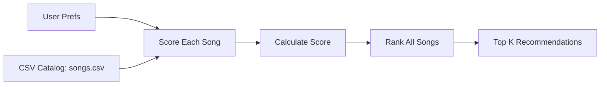

# 🎵 Music Recommender Simulation

## Project Summary

In this project you will build and explain a small music recommender system.

Your goal is to:

- Represent songs and a user "taste profile" as data
- Design a scoring rule that turns that data into recommendations
- Evaluate what your system gets right and wrong
- Reflect on how this mirrors real world AI recommenders

This project builds a simple content-based music recommender. It compares each song to a user's preferences, such as favorite genre, mood, and target energy, and gives each song a score. Songs with higher scores are shown first. This simulates a small part of what real systems do at large scale.

---

## How The System Works

Real streaming platforms usually combine multiple methods:
- Collaborative filtering: recommends songs based on behavior from similar users (likes, skips, replays, playlist adds).
- Content-based filtering: recommends songs based on song attributes that match your taste (genre, mood, energy, tempo, etc.).

In this simulator, content-based filtering is prioritized because the song attributes in `songs.csv` are easy to compare.

### Data Expansion Plan

The starter catalog has 10 songs with genre, mood, energy, tempo, valence, danceability, and acousticness. A few more songs with different genres and moods would give the recommender more variety.

Prompt to use in Copilot Chat:

> Generate 5-10 additional songs in valid CSV format using the same headers as this file. Keep the data realistic, diverse, and easy to use for a simple recommender.

### User Profile

The initial taste profile is:

```python
user_profile = {
  "favorite_genre": "rock",
  "favorite_mood": "intense",
  "target_energy": 0.88,
  "likes_acoustic": False,
  "preferred_valence": 0.45,
  "preferred_danceability": 0.70,
}
```

This profile should help the system tell apart intense songs from chill songs.

Prompt to use in Inline Chat:

> Critique this user profile for a music recommender. Is it clear enough to separate intense rock from chill lofi, or should it be simplified?

Main data types used by real systems:
- User actions: likes, skips, replays, search clicks, playlist adds, listening time.
- Song metadata and audio features: genre, mood, artist, tempo, energy, valence, danceability, acousticness.
- Context signals: time of day, activity type, device, and session behavior.

For this project, the main features are genre, mood, and energy. The other fields can help a little, but they should stay secondary.

### Algorithm Recipe

The scoring recipe is:

- Start with `score = 0`.
- Add `+2.0` for a genre match.
- Add `+1.0` for a mood match.
- Add an energy closeness score:

$$
  energy\_score = 2.5 \times (1 - |song\_energy - target\_energy|)
$$

- Optional refinements:
  - Small bonus for valence closeness.
  - Small bonus for danceability closeness.

Why these weights:
- Genre and mood are simple and easy to compare.
- Energy gets the strongest continuous weight.
- Extra features only fine-tune the result.

Ranking rule for a list of songs:
- Compute one score per song using the scoring rule.
- Sort all songs from highest score to lowest score.
- Return top `k` songs.

Why both scoring and ranking are needed:
- Scoring tells how well one song fits.
- Ranking turns many song scores into an ordered recommendation list.
- Without ranking, you cannot choose the best songs at recommendation time.

### Features Used In This Simulation

`Song` fields used:
- `id`, `title`, `artist`
- `genre`, `mood`
- `energy`, `tempo_bpm`, `valence`, `danceability`, `acousticness`

`UserProfile` fields used:
- `favorite_genre`
- `favorite_mood`
- `target_energy`
- `likes_acoustic`

Some prompts to answer:

- What features does each `Song` use in your system
  - For example: genre, mood, energy, tempo
- What information does your `UserProfile` store
- How does your `Recommender` compute a score for each song
- How do you choose which songs to recommend

You can include a simple diagram or bullet list if helpful.

### Recommendation Flow



This shows how each song gets scored and ranked.

---

## Getting Started

### Setup

1. Create a virtual environment (optional but recommended):

   ```bash
   python -m venv .venv
   source .venv/bin/activate      # Mac or Linux
   .venv\Scripts\activate         # Windows

2. Install dependencies

```bash
pip install -r requirements.txt
```

3. Run the app:

```bash
python -m src.main
```

### Running Tests

Run the starter tests with:

```bash
pytest
```

You can add more tests in `tests/test_recommender.py`.

---

## Experiments You Tried

Use this section to document the experiments you ran. For example:

- What happened when you changed the weight on genre from 2.0 to 0.5
- What happened when you added tempo or valence to the score
- How did your system behave for different types of users

Sample CLI output:

```text
Loaded songs: 10
Sunrise City | Score: 5.45
Gym Hero | Score: 4.17
Rooftop Lights | Score: 3.40
```

Evaluation notes:

- High-Energy Pop: Sunrise City stayed near the top.
- Chill Lofi: Midnight Coding and Library Rain ranked highest.
- Deep Intense Rock: Storm Runner ranked first.

---

## Limitations and Risks

Summarize some limitations of your recommender.

Examples:

- It only works on a tiny catalog
- It does not understand lyrics or language
- It might over-favor genre
- It could miss songs that match the mood but not the genre
- It may reflect the taste of the person who made the data

This system can also favor songs that look similar to the starter catalog.

You will go deeper on this in your model card.

---

## Reflection

Read and complete `model_card.md`:

[**Model Card**](model_card.md)

Write 1 to 2 paragraphs here about what you learned:

- about how recommenders turn data into predictions
- about where bias or unfairness could show up in systems like this


---

## 7. `model_card_template.md`

Combines reflection and model card framing from the Module 3 guidance. :contentReference[oaicite:2]{index=2}  

```markdown
# 🎧 Model Card - Music Recommender Simulation

## 1. Model Name

Give your recommender a name, for example:

> VibeFinder 1.0

---

## 2. Intended Use

- What is this system trying to do
- Who is it for

Example:

> This model suggests 3 to 5 songs from a small catalog based on a user's preferred genre, mood, and energy level. It is for classroom exploration only, not for real users.

---

## 3. How It Works (Short Explanation)

Describe your scoring logic in plain language.

- What features of each song does it consider
- What information about the user does it use
- How does it turn those into a number

Try to avoid code in this section, treat it like an explanation to a non programmer.

---

## 4. Data

Describe your dataset.

- How many songs are in `data/songs.csv`
- Did you add or remove any songs
- What kinds of genres or moods are represented
- Whose taste does this data mostly reflect

---

## 5. Strengths

Where does your recommender work well

You can think about:
- Situations where the top results "felt right"
- Particular user profiles it served well
- Simplicity or transparency benefits

---

## 6. Limitations and Bias

Where does your recommender struggle

Some prompts:
- Does it ignore some genres or moods
- Does it treat all users as if they have the same taste shape
- Is it biased toward high energy or one genre by default
- How could this be unfair if used in a real product

---

## 7. Evaluation

How did you check your system

Examples:
- You tried multiple user profiles and wrote down whether the results matched your expectations
- You compared your simulation to what a real app like Spotify or YouTube tends to recommend
- You wrote tests for your scoring logic

You do not need a numeric metric, but if you used one, explain what it measures.

---

## 8. Future Work

If you had more time, how would you improve this recommender

Examples:

- Add support for multiple users and "group vibe" recommendations
- Balance diversity of songs instead of always picking the closest match
- Use more features, like tempo ranges or lyric themes

---

## 9. Personal Reflection

A few sentences about what you learned:

- What surprised you about how your system behaved
- How did building this change how you think about real music recommenders
- Where do you think human judgment still matters, even if the model seems "smart"

