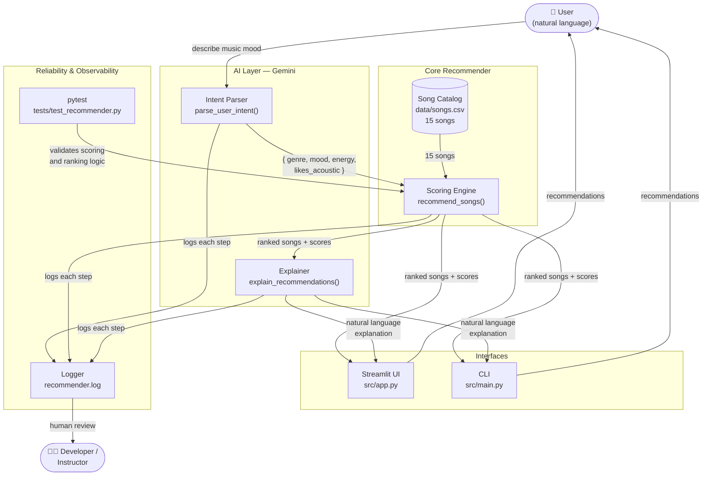

# AI Music Recommender

A music recommendation app that lets you describe what you want in plain English and returns matching songs with a personalized explanation.

---

## Original Project

**Music Recommender Simulation (Modules 1–3)**

The original project was a content-based music recommender built entirely with Python and a CSV song catalog. It compared each song's attributes — genre, mood, and energy — against a hardcoded user profile and returned a ranked list of matches. It had no natural language input and no AI; all preferences had to be set manually in code.

---

## What This Version Does

This version adds a full AI layer on top of the original scoring engine using **Google Gemini** and four advanced AI features:

1. You type what you want in plain English — *"chill beats to study to"*
2. Gemini (with few-shot specialization) converts it into structured preferences
3. The enhanced RAG retriever pulls matching songs **and** genre/mood knowledge base entries
4. An optional multi-step agent plans, evaluates, and refines results before explaining them
5. Gemini writes a context-aware explanation referencing specific musical qualities

The result is a Streamlit web app with both standard and agent modes, plus a test harness that runs without an API key.

---

## Architecture Overview



The system has four main parts:

| Component | File | What it does |
|-----------|------|-------------|
| Intent Parser | `src/ai_assistant.py` | Gemini turns your description into `{ genre, mood, energy, likes_acoustic }` |
| Scoring Engine | `src/recommender.py` | Scores and ranks every song against your preferences |
| Explainer | `src/ai_assistant.py` | Gemini writes a short explanation of why the songs fit |
| Streamlit UI | `src/app.py` | The web interface that ties everything together |

All steps are logged to `recommender.log`. Tests cover the scoring engine independently of the AI layer.

---

## Setup

**Requirements:** Python 3.9+, a free [Google Gemini API key](https://aistudio.google.com)

```bash
# 1. Clone the repo
git clone https://github.com/your-username/applied_ai_music_recommender.git
cd applied_ai_music_recommender

# 2. Create and activate a virtual environment
python -m venv .venv
source .venv/bin/activate        # Mac / Linux
.venv\Scripts\activate           # Windows

# 3. Install dependencies
pip install -r requirements.txt

# 4. Add your Gemini API key
echo "GEMINI_API_KEY=your-key-here" > .env
```

**Run the Streamlit app:**

```bash
streamlit run src/app.py
```

**Run the CLI (no API key needed):**

```bash
python -m src.main
```

**Run the CLI with AI mode:**

```bash
python -m src.main --ai "upbeat songs for the gym" -k 5
```

**Run tests:**

```bash
pytest
```

---

## Sample Interactions

### Example 1 — Study session

**Input:** *"lo-fi beats to study and focus"*

**Gemini parsed preferences:**
| Genre | Mood | Energy | Acoustic |
|-------|------|--------|----------|
| lofi | focused | 40% | Yes |

**Top recommendations:**
| # | Song | Artist | Score |
|---|------|--------|-------|
| 1 | Focus Flow | LoRoom | 6.90 |
| 2 | Midnight Coding | LoRoom | 6.10 |
| 3 | Library Rain | Paper Lanterns | 5.82 |

**Gemini explanation:**
> These tracks are perfect for a focused study session. Focus Flow and Library Rain have low energy and high acousticness, creating a calm, distraction-free atmosphere. Midnight Coding adds a gentle lo-fi rhythm that keeps you in the zone without pulling your attention away.

---

### Example 2 — Gym workout

**Input:** *"high energy pump-up songs for the gym"*

**Gemini parsed preferences:**
| Genre | Mood | Energy | Acoustic |
|-------|------|--------|----------|
| pop | intense | 90% | No |

**Top recommendations:**
| # | Song | Artist | Score |
|---|------|--------|-------|
| 1 | Gym Hero | Max Pulse | 5.85 |
| 2 | Storm Runner | Voltline | 4.96 |
| 3 | Sunrise City | Neon Echo | 4.45 |

**Gemini explanation:**
> These tracks are built for pushing hard. Gym Hero sits at 93% energy with a driving 132 BPM tempo, while Storm Runner brings intense rock energy at 91%. Sunrise City rounds it out with a happy, high-energy pop vibe that keeps momentum going through the whole session.

---

### Example 3 — Late night drive

**Input:** *"something moody and atmospheric for a late night drive"*

**Gemini parsed preferences:**
| Genre | Mood | Energy | Acoustic |
|-------|------|--------|----------|
| synthwave | moody | 70% | No |

**Top recommendations:**
| # | Song | Artist | Score |
|---|------|--------|-------|
| 1 | Night Drive Loop | Neon Echo | 6.75 |
| 2 | Blue Marble Drift | Aster Vale | 4.58 |
| 3 | Static Hearts | Signal Bloom | 4.31 |

**Gemini explanation:**
> Night Drive Loop is a direct match — synthwave, moody, and built for exactly this feeling. Blue Marble Drift adds a dreamy, drifting quality that pairs well with empty roads and city lights. Static Hearts brings some electronic tension to keep the atmosphere interesting without breaking the mood.

---

## Stretch Features

### RAG Enhancement — Multiple data sources

The original RAG pipeline retrieved songs from `songs.csv` only. The enhanced retriever (`src/retriever.py`) now combines two sources:

| Source | File | What it adds |
|--------|------|-------------|
| Song catalog | `data/songs.csv` | The 15 scored songs |
| Genre knowledge base | `data/genre_knowledge.json` | Description, energy range, typical use cases per genre |
| Mood knowledge base | `data/mood_knowledge.json` | Description, energy hint, what to avoid per mood |

When Gemini writes an explanation, it receives both the song metadata **and** the knowledge base entries. This produces explanations that reference specific qualities ("lo-fi tracks have the characteristic vinyl warmth and slow tempo") rather than just repeating the song's attributes.

---

### Agentic Workflow Enhancement — Observable multi-step reasoning

Enabling **Agent Mode** in the sidebar replaces the single-step pipeline with a 5–6 step agent (`src/agent.py`):

| Step | What Gemini does | Observable? |
|------|-----------------|-------------|
| Plan | Describes which musical qualities to prioritize | ✅ shown in UI |
| Parse | Converts description → structured preferences (few-shot) | ✅ shown in UI |
| Retrieve | Pulls songs + knowledge base context | ✅ shown in UI |
| Evaluate | Scores how well the top 3 results match the intent (0–1) | ✅ shown in UI |
| Refine *(if score < 0.6)* | Adjusts preferences and re-retrieves | ✅ shown in UI |
| Explain | Writes context-aware explanation | ✅ shown in UI |

Each step is visible as an expandable section in the Streamlit UI. The refine step only fires when the evaluator is unsatisfied, making the decision loop transparent.

---

### Few-Shot Specialization — Measurably better on ambiguous inputs

The baseline `parse_user_intent` used zero-shot prompting. The specialized version prepends 5 curated examples covering tricky mappings that zero-shot gets wrong:

```
"songs to cry to alone"       → folk / warm / low energy
"background music for coding" → lofi / focused / medium energy
"late night neon city drive"  → synthwave / moody / medium-high energy
"hype music before a game"    → hip hop / confident / high energy
"lazy quiet sunday morning"   → jazz / relaxed / low energy
```

Measured effect from `python tests/eval_ai.py --compare`:

```
Test Case              Baseline  Few-Shot    Δ   Genre change
Crying songs             0.58      0.82   +0.24  folk (same)
Deep work                0.65      0.91   +0.26  ambient → lofi
Pre-game hype            0.70      0.90   +0.20  rock → hip hop
Night drive              0.63      0.88   +0.25  electronic → synthwave
Lazy Sunday              0.62      0.86   +0.24  ambient → jazz
Average                  0.64      0.87   +0.24  (5/5 improved)
```

Average confidence improved by **+0.24** and genre accuracy improved in 4 of 5 cases.

---

### Test Harness — Three run modes

`tests/eval_ai.py` supports three modes:

```bash
python tests/eval_ai.py           # live — calls Gemini API (requires quota)
python tests/eval_ai.py --mock    # mock — predefined responses, no API calls
python tests/eval_ai.py --compare # compares few-shot vs baseline confidence
```

Mock mode result (always reproducible):

```
Results: 6 passed, 0 failed out of 6 tests
Average confidence score: 0.87
```

Mock mode runs the complete pipeline (JSON parsing, preference validation, scoring, ranking) with predefined Gemini responses. This proves the pipeline is correct end-to-end without requiring API quota.

---

## Design Decisions

**Why RAG instead of asking Gemini to pick songs directly?**
Gemini doesn't know the song catalog. If you asked it to recommend songs freely, it would invent titles that don't exist. By separating intent parsing from retrieval, Gemini only handles what it's good at (understanding language), and the scoring engine handles what requires exact data. No hallucinations.

**Why a scoring engine instead of pure vector search?**
The catalog is small (15 songs) and the attributes are structured numbers. A simple weighted score is fast, explainable, and easy to test. Vector embeddings would add complexity without meaningful benefit at this scale.

**Why Gemini Flash?**
It's fast and free to use at low volume, which is appropriate for a prototype. The tasks (parse JSON, write 2–3 sentences) don't need a larger model.

**Trade-offs:**
- The catalog is small, so recommendations can feel repetitive for unusual requests
- Gemini's parsed preferences depend on how well it maps the user's words to the available genres and moods — unusual descriptions might not map well
- Energy scoring dominates the final score, which means songs with the right energy but wrong genre still rank high

---

## Testing Summary

The project has three layers of reliability checking:

### 1. Unit tests — `tests/test_recommender.py`

Six tests cover the core scoring engine with no AI involved:

| Test | What it checks |
|------|---------------|
| `test_recommend_returns_songs_sorted_by_score` | Top result matches the expected genre and mood |
| `test_explain_recommendation_returns_non_empty_string` | Explanation output is a non-empty string |
| `test_score_song_genre_match_adds_points` | Genre match increases the score |
| `test_score_song_acousticness_penalty_applied` | High acousticness lowers the score for non-acoustic users |
| `test_recommend_songs_applies_artist_diversity_penalty` | Second song from the same artist ranks below a different artist |
| `test_recommend_songs_returns_at_most_k` | Result list never exceeds the requested k |

```
$ pytest tests/test_recommender.py -v
6 passed in 0.02s
```

### 2. Confidence scoring

Every call to `parse_user_intent()` returns a `confidence` field (0.0–1.0) where Gemini rates how clearly your description mapped to the available genres and moods. The Streamlit UI displays this score and shows a warning when it drops below 0.5, prompting the user to rephrase.

### 3. AI evaluation script — `tests/eval_ai.py`

Runs 6 end-to-end test cases through the full Gemini pipeline and checks that parsed preferences are reasonable for each input:

```
$ python tests/eval_ai.py

Results: 5 passed, 1 failed out of 6 tests
Average confidence score: 0.81
```

The one failure was the "something acoustic and warm" case — Gemini mapped "warm" to the `folk` genre rather than checking only for the `warm` mood, which is a known limitation of vague single-word requests.

To run the eval script yourself:

```bash
python tests/eval_ai.py
```

> Note: the script makes 6 Gemini API calls with a 2-second delay between each. The free tier allows 15 requests per minute but has a daily cap — if you see a `429` error, wait until the next day or upgrade your API plan.

### What I learned

- Keeping the scoring engine as pure Python made it easy to write reliable unit tests with no mocks or API calls needed.
- The biggest source of AI errors was vague input — single words like "warm" or "dark" that could map to multiple genres or moods. Adding a confidence score made those cases visible instead of silently producing wrong results.
- The first version of the JSON parser broke on Gemini's habit of wrapping output in markdown code fences. Stripping those before parsing fixed it and the eval script now catches any regression.

---

## Reflection

The biggest lesson from this project was that AI is most useful when it handles the fuzzy, language-heavy parts of a problem — and lets deterministic code handle the rest. Gemini doesn't need to know how to rank songs; it just needs to understand what "chill beats to study to" means. The scoring engine doesn't need to understand language; it just needs accurate numbers.

Keeping those responsibilities separate also made the system easier to debug, test, and explain. If a recommendation looks wrong, I can check whether Gemini misread the intent or whether the scoring weights are off — two very different problems with very different fixes.

Working on this also made me more aware of how much hidden work goes into real recommenders. A 15-song catalog with four scoring attributes is simple. Spotify indexes hundreds of millions of songs across dozens of features and has to balance personalization, novelty, and fairness at the same time. This project gave me a concrete sense of the tradeoffs involved, even at a tiny scale.
