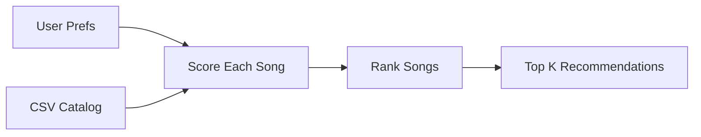

# 🎵 Music Recommender Simulation

## Project Summary

An AI-powered music recommender that combines **Retrieval-Augmented Generation (RAG)** with a
content-based scoring engine. Users describe what they want in plain English; Claude parses
their intent into structured preferences, the recommender retrieves the best matching songs
from the catalog, and Claude explains why each song fits — all in a Streamlit UI.

### AI Feature: RAG + Agentic Workflow

| Step | What happens |
|------|-------------|
| **Query understanding** | Gemini converts a free-text description into `{genre, mood, energy, likes_acoustic}` |
| **Retrieval** | The scoring engine ranks every song against those preferences |
| **Generation** | Claude reads the retrieved songs and writes a personalized explanation |

This is a complete RAG pipeline: Gemini never hallucinates song titles because it only
reasons over catalog data that was retrieved first.

---

## How The System Works

Real recommendation systems usually combine two ideas: collaborative filtering, which learns from patterns across many users such as likes, skips, playlists, and watch or listening time, and content-based filtering, which uses item attributes such as genre, mood, tempo, or energy. This simulator focuses on content-based filtering, so it recommends songs by comparing each song's attributes to one user's stated preferences. My version prioritizes genre, mood, and especially energy closeness, with a small acousticness penalty to avoid highly acoustic songs for users who do not want them.

### Data Plan

The catalog now has 15 songs with genre, mood, energy, tempo, valence, danceability, and acousticness. I expanded it with additional genres and moods such as reggaeton, electronic, folk, dream pop, and hip hop so the recommender has more variety to compare.

Prompt for Copilot Chat:

> Generate 5-10 additional songs in valid CSV format using the same headers as `songs.csv`. Keep the songs realistic and diverse.

### User Profile

The initial taste profile is:

```python
user_profile = {
  "favorite_genre": "rock",
  "favorite_mood": "intense",
  "target_energy": 0.88,
  "likes_acoustic": False,
}
```

This should help the system separate intense rock from chill lofi.

### Algorithm Recipe

- Add points for a genre match.
- Add points for a mood match.
- Add a larger energy score based on how close the song's energy is to the user's target energy.
- Apply a small penalty when a user does not like acoustic songs and the song's acousticness is very high.
- Rank the full song list from highest score to lowest score.

The scoring rule is for one song, and the ranking rule sorts all songs by score so the top matches come first. In the current implementation, the exact weights can shift by scoring mode, but the main idea stays the same: energy similarity matters most, while genre and mood help define the vibe.

### Flow



### Bias Notes

This system may over-favor genre if the dataset is small or uneven. It can also miss good songs that match mood and energy but not genre.
It may also under-recommend newer genres if there are still only one or two examples of them in the catalog.

### Features Used In This Simulation

`Song` object fields stored:
- `id`, `title`, `artist`
- `genre`, `mood`
- `energy`, `tempo_bpm`, `valence`, `danceability`, `acousticness`

`UserProfile` object fields stored:
- `favorite_genre`
- `favorite_mood`
- `target_energy`
- `likes_acoustic`

Features currently used for scoring:
- `genre`
- `mood`
- `energy`
- `acousticness`

The basic idea is to score one song at a time, then rank all songs from best match to worst match.

---

## Getting Started

### Setup

1. Create and activate a virtual environment:

   ```bash
   python -m venv .venv
   source .venv/bin/activate      # Mac / Linux
   .venv\Scripts\activate         # Windows
   ```

2. Install dependencies:

   ```bash
   pip install -r requirements.txt
   ```

3. Add your Gemini API key to a `.env` file in the project root:

   ```
   GEMINI_API_KEY=your-key-here
   ```

   Get a free key at [aistudio.google.com](https://aistudio.google.com). The `.env` file is
   listed in `.gitignore` and will never be committed.

### Running the App

**Streamlit UI (recommended — AI-powered):**

```bash
streamlit run src/app.py
```

Open the URL printed in your terminal. Type a natural language description such as
*"chill beats to study to"* and Claude will interpret your request, retrieve matching songs,
and explain the recommendations.

**CLI — preset experiments:**

```bash
python -m src.main
```

**CLI — AI natural language mode:**

```bash
python -m src.main --ai "upbeat songs for the gym" -k 5
```

All runs write structured logs to `recommender.log` in the project root.

### Running Tests

```bash
pytest
```

You can add more tests in `tests/test_recommender.py`.

---

## Experiments You Tried

Use this section to document the experiments you ran. For example:

- What happened when you changed the weight on genre from 2.0 to 0.5
- What happened when you added tempo or valence to the score
- How did your system behave for different types of users

Sample CLI output:

```text
Loaded songs: 15
Sunrise City | Score: 5.45
Gym Hero | Score: 4.17
Rooftop Lights | Score: 3.40
```

Evaluation notes:

- High-Energy Pop: Sunrise City stayed near the top.
- Chill Lofi: Midnight Coding and Library Rain ranked highest.
- Deep Intense Rock: Storm Runner ranked first.

Screenshots included for submission:

- High-Energy Pop recommendations:

  

- Chill Lofi recommendations:

  

- Deep Intense Rock recommendations:

  

---

## Limitations and Risks

Summarize some limitations of your recommender.

Examples:

- It only works on a tiny catalog
- It does not understand lyrics or language
- It might over-favor genre
- It could miss songs that match the mood but not the genre
- It may reflect the taste of the person who made the data

This system can also favor songs that look similar to the starter catalog, even after expansion.

You will go deeper on this in your model card.

---

## Reflection

[**Model Card**](model_card.md)

The model card explains the final system in more detail, including the data, strengths, limitations, and bias notes.


## 7. Evaluation

I checked the system by running multiple user profiles and comparing the rankings to the vibe each profile was supposed to represent. High-Energy Pop, Chill Lofi, and Deep Intense Rock each produced different top results, which showed that the scoring logic was responding to genre, mood, and energy as expected. I also ran the starter tests and verified that the CLI printed readable recommendation tables.

---

## 8. Future Work

If I had more time, I would expand the catalog, balance the genres and moods more evenly, and add more song features so the ranking has richer information to use. I would also improve diversity so the same songs or artists do not appear too often across different profiles.

---

## 9. Personal Reflection

What surprised me most was how much the ranking changed when I changed the scoring weights, even on a small catalog. A small rule change could move a song from the top to the middle of the list.

Building this made me think of real music recommenders as systems that make tradeoffs, not perfect predictors. They can match mood and genre well, but they still depend on limited data and simple assumptions.

Human judgment still matters when deciding what songs should count as a good recommendation, whether the results feel fair, and whether the system is repeating the same patterns too often. A model can look smart, but people still need to check if the output actually makes sense.
