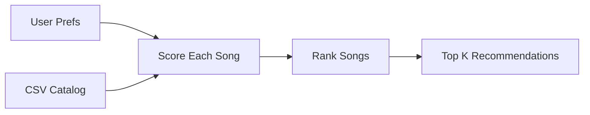

# 🎵 Music Recommender Simulation

## Project Summary

In this project you will build and explain a small music recommender system.

Your goal is to:

- Represent songs and a user "taste profile" as data
- Design a scoring rule that turns that data into recommendations
- Evaluate what your system gets right and wrong
- Reflect on how this mirrors real world AI recommenders

This project builds a simple content-based music recommender. It compares each song to a user's preferences, such as favorite genre, mood, and target energy, and gives each song a score. Songs with higher scores are shown first. This simulates a small part of what real systems do at large scale.

---

## How The System Works

Real recommendation systems usually combine two ideas: collaborative filtering, which learns from other users' behavior, and content-based filtering, which uses song attributes. This simulator will start simple and focus on content-based filtering, so songs are scored by how well their genre, mood, and energy match the user profile.

### Data Plan

The starter catalog has 10 songs with genre, mood, energy, tempo, valence, danceability, and acousticness. A simple extension would add a few more songs with different genres and moods so the catalog has more variety.

Prompt for Copilot Chat:

> Generate 5-10 additional songs in valid CSV format using the same headers as `songs.csv`. Keep the songs realistic and diverse.

### User Profile

The initial taste profile is:

```python
user_profile = {
  "favorite_genre": "rock",
  "favorite_mood": "intense",
  "target_energy": 0.88,
  "likes_acoustic": False,
}
```

This should help the system separate intense rock from chill lofi.

### Algorithm Recipe

- Add `+2.0` for a genre match.
- Add `+1.0` for a mood match.
- Add energy points based on closeness to the target energy.
- Use smaller bonus points for other features like valence or danceability if needed.

The scoring rule is for one song, and the ranking rule sorts all songs by score so the top matches come first.

### Flow



### Bias Notes

This system may over-favor genre if the dataset is small or uneven. It can also miss good songs that match mood and energy but not genre.

### Features Used In This Simulation

`Song` fields used:
- `id`, `title`, `artist`
- `genre`, `mood`
- `energy`, `tempo_bpm`, `valence`, `danceability`, `acousticness`

`UserProfile` fields used:
- `favorite_genre`
- `favorite_mood`
- `target_energy`
- `likes_acoustic`

The basic idea is to score one song at a time, then rank all songs from best match to worst match.

---

## Getting Started

### Setup

1. Create a virtual environment (optional but recommended):

   ```bash
   python -m venv .venv
   source .venv/bin/activate      # Mac or Linux
   .venv\Scripts\activate         # Windows
  ```

2. Install dependencies

```bash
pip install -r requirements.txt
```

3. Run the app:

```bash
python -m src.main
```

### Running Tests

Run the starter tests with:

```bash
pytest
```

You can add more tests in `tests/test_recommender.py`.

---

## Experiments You Tried

Use this section to document the experiments you ran. For example:

- What happened when you changed the weight on genre from 2.0 to 0.5
- What happened when you added tempo or valence to the score
- How did your system behave for different types of users

Sample CLI output:

```text
Loaded songs: 10
Sunrise City | Score: 5.45
Gym Hero | Score: 4.17
Rooftop Lights | Score: 3.40
```

Evaluation notes:

- High-Energy Pop: Sunrise City stayed near the top.
- Chill Lofi: Midnight Coding and Library Rain ranked highest.
- Deep Intense Rock: Storm Runner ranked first.

Screenshots included for submission:

- High-Energy Pop recommendations:

  

- Chill Lofi recommendations:

  

- Deep Intense Rock recommendations:

  

---

## Limitations and Risks

Summarize some limitations of your recommender.

Examples:

- It only works on a tiny catalog
- It does not understand lyrics or language
- It might over-favor genre
- It could miss songs that match the mood but not the genre
- It may reflect the taste of the person who made the data

This system can also favor songs that look similar to the starter catalog.

You will go deeper on this in your model card.

---

## Reflection

Read and complete `model_card.md`:

[**Model Card**](model_card.md)

Write 1 to 2 paragraphs here about what you learned:

- about how recommenders turn data into predictions
- about where bias or unfairness could show up in systems like this


## 7. Evaluation

How did you check your system

Examples:
- You tried multiple user profiles and wrote down whether the results matched your expectations
- You compared your simulation to what a real app like Spotify or YouTube tends to recommend
- You wrote tests for your scoring logic

You do not need a numeric metric, but if you used one, explain what it measures.

---

## 8. Future Work

If you had more time, how would you improve this recommender

Examples:

- Add support for multiple users and "group vibe" recommendations
- Balance diversity of songs instead of always picking the closest match
- Use more features, like tempo ranges or lyric themes

---

## 9. Personal Reflection

A few sentences about what you learned:

- What surprised you about how your system behaved
- How did building this change how you think about real music recommenders
- Where do you think human judgment still matters, even if the model seems "smart"

